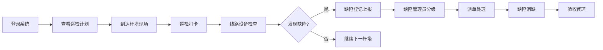
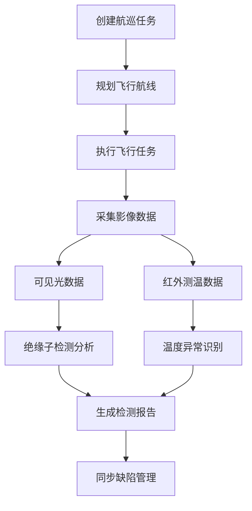

## 1. 产品概述

高压输电线路巡检客户端软件是面向电力运维部门的专业管理平台，用于输电线路、杆塔、巡检、缺陷等核心业务的数字化管理。通过整合人工巡检、无人机航巡、红外测温、带电作业等多种巡检手段，实现输电线路全生命周期的智能化运维管理，提升电网安全运行水平。

- 目标用户：电力运维人员、线路巡检员、缺陷管理员、带电作业人员、运维管理人员
- 核心价值：提升巡检效率、规范缺陷管理、保障电网安全、降低运维成本

## 2. 核心功能

### 2.1 用户角色

| 角色 | 登录方式 | 核心权限 |
|------|----------|----------|
| 系统管理员 | 账号密码登录 | 用户管理、系统配置、全模块权限 |
| 运维管理人员 | 账号密码登录 | 数据统计、计划审批、报表查看 |
| 线路巡检员 | 账号密码登录 | 巡检打卡、缺陷上报、杆塔信息查看 |
| 无人机操作员 | 账号密码登录 | 航巡任务管理、红外测温、绝缘子检测 |
| 带电作业人员 | 账号密码登录 | 作业票管理、作业记录 |

### 2.2 功能模块

1. **线路台账**：输电线路基础信息管理，包含线路列表、线路详情、电压等级管理
2. **杆塔档案**：杆塔基础档案管理，包含杆塔列表、杆塔详情、杆塔类型管理
3. **巡检计划**：巡检计划制定与执行，包含检修计划、人工巡检打卡、巡检记录
4. **缺陷管理**：缺陷全生命周期管理，包含缺陷分级登记、缺陷处理、缺陷统计
5. **无人机巡检**：无人机航巡管理，包含航巡任务、红外测温、绝缘子检测
6. **带电作业**：带电作业管理，包含作业票管理、作业记录、作业统计
7. **运行统计**：综合运行分析，包含通道隐患、覆冰舞动监测、运行分析报表

### 2.3 页面详情

| 页面名称 | 模块名称 | 功能描述 |
|---------|---------|---------|
| 工作台 | 运行统计 | 数据概览卡片、待办事项、近期缺陷、巡检进度 |
| 线路台账页 | 线路台账 | 线路列表、搜索筛选、线路详情侧边栏、新增/编辑线路 |
| 杆塔档案页 | 杆塔档案 | 杆塔列表、按线路筛选、杆塔详情、杆塔分布图 |
| 巡检计划页 | 巡检计划 | 计划列表、计划详情、巡检打卡、巡检记录查询 |
| 缺陷管理页 | 缺陷管理 | 缺陷列表、分级筛选、缺陷详情、缺陷处理流程 |
| 无人机巡检页 | 无人机巡检 | 航巡任务列表、红外测温记录、绝缘子检测结果 |
| 带电作业页 | 带电作业 | 作业票列表、作业详情、作业记录、作业统计 |
| 运行分析页 | 运行统计 | 多维度统计图表、通道隐患、覆冰舞动监测 |

## 3. 核心流程

### 3.1 巡检工作流程

巡检员登录系统后，查看当日巡检计划，前往指定杆塔进行现场巡检，通过打卡功能记录巡检位置和时间，发现缺陷时进行缺陷登记并上传照片，缺陷流转至缺陷管理员进行分级和派单处理。

### 3.2 无人机巡检流程

无人机操作员接收航巡任务，规划航线执行飞行，采集可见光和红外热成像数据，通过AI识别绝缘子缺陷和温度异常，生成检测报告并同步至缺陷管理模块。

## 4. 用户界面设计

### 4.1 设计风格

- **主色调**：深蓝色系（电力行业标准色），主色 #1677ff，辅助色 #0958d9
- **强调色**：橙色 #fa8c16（告警/缺陷）、绿色 #52c41a（正常/完成）、红色 #ff4d4f（紧急/危险）
- **按钮风格**：圆角矩形按钮，悬停有阴影和颜色过渡效果
- **字体**：中文使用"PingFang SC"，数字和英文使用"Roboto Mono"，标题加粗，正文清晰易读
- **布局风格**：左侧导航栏 + 顶部工具栏 + 主内容区的经典后台管理布局
- **图标风格**：线性图标，使用 Lucide React 图标库
- **整体风格**：工业风、专业、稳重、数据驱动，突出电力行业特性

### 4.2 页面设计概览

| 页面名称 | 模块名称 | UI 元素 |
|---------|---------|---------|
| 工作台 | 运行统计 | 数据卡片网格、待办事项列表、缺陷趋势图、巡检进度条、快捷入口 |
| 线路台账页 | 线路台账 | 搜索栏、筛选条件、数据表格、分页器、详情抽屉、表单弹窗 |
| 杆塔档案页 | 杆塔档案 | 线路树状导航、杆塔列表、杆塔详情卡片、分布图占位 |
| 巡检计划页 | 巡检计划 | 计划日历视图、任务列表、打卡按钮、巡检记录时间线 |
| 缺陷管理页 | 缺陷管理 | 缺陷等级标签、状态筛选、列表视图、处理流程步骤条 |
| 无人机巡检页 | 无人机巡检 | 任务卡片、进度条、数据图表、检测结果表格 |
| 带电作业页 | 带电作业 | 作业票状态流、作业信息卡片、统计图表、审批按钮 |
| 运行分析页 | 运行统计 | 多维度图表、数据筛选、统计报表、监测仪表盘 |

### 4.3 响应式设计

- 桌面端优先设计，最小支持 1366px 宽度
- 侧边栏可折叠，适配不同屏幕尺寸
- 数据表格支持横向滚动
- 卡片式布局在小屏幕下自动换行

### 4.4 数据可视化

- 使用 Recharts 图表库实现数据可视化
- 缺陷趋势图、巡检完成率、设备健康度等核心指标图表化展示
- 仪表盘风格的统计卡片，带有渐变色和微动效
