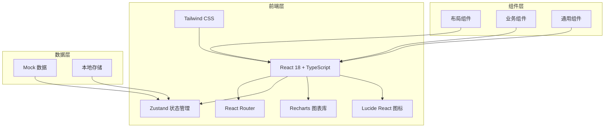
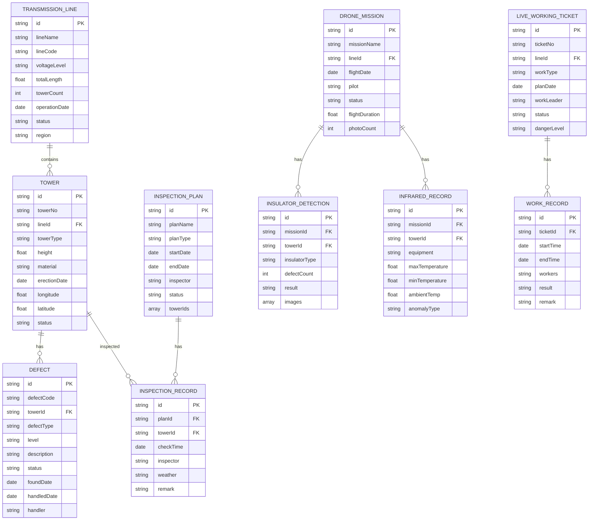

## 1. 架构设计



## 2. 技术说明

- 前端框架：React@18 + TypeScript
- 构建工具：Vite@5
- 样式方案：Tailwind CSS@3
- 路由管理：React Router DOM@6
- 状态管理：Zustand
- UI 图标：Lucide React
- 图表库：Recharts
- 数据方案：Mock 数据（前端模拟）
- 初始化工具：vite-init

## 3. 路由定义

| 路由路径 | 页面名称 | 说明 |
|---------|---------|------|
| /dashboard | 工作台 | 数据概览和快捷入口 |
| /transmission-lines | 线路台账 | 输电线路基础信息管理 |
| /towers | 杆塔档案 | 杆塔基础档案管理 |
| /inspection-plans | 巡检计划 | 巡检计划与打卡管理 |
| /defects | 缺陷管理 | 缺陷登记与处理 |
| /drone-inspection | 无人机巡检 | 航巡任务与检测结果 |
| /live-working | 带电作业 | 作业票与作业记录 |
| /statistics | 运行分析 | 综合统计与监测 |

## 4. 数据模型

### 4.1 数据模型定义



### 4.2 模拟数据说明

- 使用 TypeScript 定义完整的数据类型
- 在 `src/data/mock/` 目录下创建各模块模拟数据
- 数据包含合理的业务场景数据，覆盖各模块核心字段
- 状态值使用枚举类型，确保数据一致性

## 5. 项目结构

```
src/
├── components/          # 通用组件
│   ├── Layout/         # 布局组件
│   ├── Card/           # 卡片组件
│   ├── Table/          # 表格组件
│   ├── Chart/          # 图表组件
│   └── common/         # 其他通用组件
├── pages/              # 页面组件
│   ├── Dashboard/      # 工作台
│   ├── TransmissionLines/  # 线路台账
│   ├── Towers/         # 杆塔档案
│   ├── InspectionPlans/   # 巡检计划
│   ├── Defects/        # 缺陷管理
│   ├── DroneInspection/   # 无人机巡检
│   ├── LiveWorking/    # 带电作业
│   └── Statistics/     # 运行分析
├── store/              # 状态管理
│   └── useAppStore.ts
├── data/               # 数据
│   ├── types/          # 类型定义
│   └── mock/           # Mock 数据
├── utils/              # 工具函数
├── router/             # 路由配置
├── App.tsx
└── main.tsx
```

## 6. 核心技术决策

### 6.1 状态管理

采用 Zustand 作为全局状态管理方案，相比 Redux 更轻量简洁。主要管理：
- 用户登录状态
- 侧边栏折叠状态
- 当前选中的线路/杆塔
- 全局通知消息

### 6.2 样式方案

使用 Tailwind CSS 原子化 CSS 方案：
- 自定义电力行业主题色
- 统一的间距和字体规范
- 组件级样式通过 class 组合实现
- 暗色/亮色主题支持（预留）

### 6.3 图表方案

使用 Recharts 实现数据可视化：
- 折线图：缺陷趋势、巡检完成率
- 柱状图：各线路缺陷对比
- 饼图：缺陷等级分布
- 面积图：覆冰舞动监测数据
